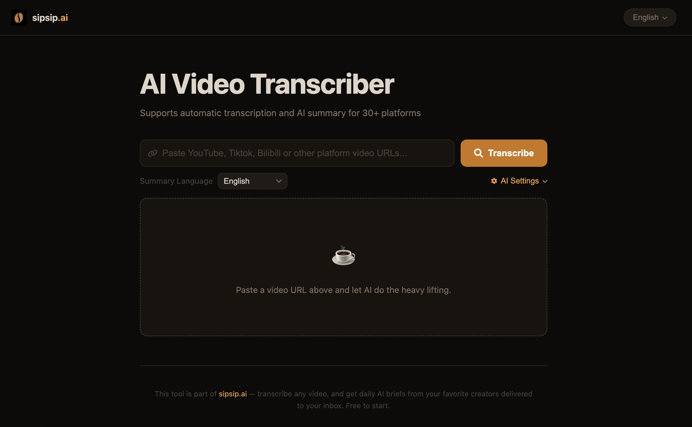

<div align="center">

# AI Video Transcriber (เครื่องมือถอดความวิดีโอด้วย AI)

ไทย | [English](README.md) | [中文](README_ZH.md)

เครื่องมือที่ขับเคลื่อนด้วย AI สำหรับการถอดความและสรุปเนื้อหาวิดีโอและพอดแคสต์ — รองรับ YouTube, TikTok, Bilibili, Apple Podcasts, SoundCloud และแพลตฟอร์มอื่นๆ อีกกว่า 30 แห่ง



</div>

## ✨ คุณสมบัติเด่น

- 🎥 **รองรับหลายแพลตฟอร์ม**: ใช้งานได้กับ YouTube, TikTok, Bilibili, Apple Podcasts, SoundCloud และอื่นๆ อีกกว่า 30 แพลตฟอร์ม
- ⚡ **สถาปัตยกรรมเน้นซับไตเติ้ล**: สำหรับแพลตฟอร์มที่มีซับไตเติ้ลในตัว (เช่น YouTube) ระบบจะดึงข้อความออกมาทันทีโดยไม่ต้องดาวน์โหลดเสียง ทำให้ทำงานได้รวดเร็วมาก โดยจะใช้ Whisper เป็นทางเลือกสำรองเท่านั้น
- 🗣️ **การถอดความอัจฉริยะ**: ใช้ Faster-Whisper เพื่อถอดเสียงเป็นข้อความที่มีความแม่นยำสูงเมื่อไม่มีซับไตเติ้ล
- 🤖 **การปรับแต่งข้อความด้วย AI**: แก้ไขคำผิด เติมประโยคให้สมบูรณ์ และจัดย่อหน้าอย่างชาญฉลาดโดยอัตโนมัติ
- 🌏 **สรุปเนื้อหาหลายภาษา**: สร้างบทสรุปอัจฉริยะในหลายภาษา
- 🛠️ **ใช้โมเดลของคุณเอง**: กำหนดค่า API endpoint ที่รองรับ OpenAI (OpenAI, OpenRouter, local LLM ฯลฯ) ได้โดยตรงผ่านหน้า UI — เพียงกรอก API Base URL และ API Key แล้วคลิก **Fetch** เพื่อดึงรายชื่อโมเดลทั้งหมดมาเลือกใช้
- ⚙️ **การแปลเงื่อนไข**: แปลบทถอดความโดยอัตโนมัติเมื่อภาษาของบทสรุปต่างจากภาษาต้นทาง
- 📱 **รองรับมือถือ**: ออกแบบมาให้ใช้งานบนอุปกรณ์พกพาได้อย่างสมบูรณ์แบบ

## 🚀 เริ่มต้นใช้งานอย่างรวดเร็ว

### สิ่งที่ต้องมีก่อนติดตั้ง

- Python 3.8+
- FFmpeg
- API key จากผู้ให้บริการที่รองรับ OpenAI (OpenAI, OpenRouter ฯลฯ) — ตั้งค่าผ่าน UI ได้โดยตรง

### การติดตั้ง

#### วิธีที่ 1: ติดตั้งอัตโนมัติ

```bash
# โคลน Repository
git clone https://github.com/Jacobgg994/AI-Video-Transcriber.git
cd AI-Video-Transcriber

# รันสคริปต์ติดตั้ง
chmod +x install.sh
./install.sh
```

#### วิธีที่ 2: ใช้ Docker

```bash
# โคลน Repository
git clone https://github.com/Jacobgg994/AI-Video-Transcriber.git
cd AI-Video-Transcriber

# ใช้ Docker Compose (ง่ายที่สุด)
cp .env.example .env
docker-compose up -d
```

#### วิธีที่ 3: ติดตั้งด้วยตัวเอง

1. **ติดตั้ง Dependencies ของ Python**
```bash
python3 -m venv venv
source venv/bin/activate
pip install -r requirements.txt
```

2. **ติดตั้ง FFmpeg**
```bash
# macOS
brew install ffmpeg

# Ubuntu/Debian
sudo apt update && sudo apt install ffmpeg
```

3. **รันบริการ**
```bash
python3 start.py
```
หลังจากเริ่มบริการแล้ว ให้เปิดเบราว์เซอร์ไปที่ `http://localhost:8000`

## 📖 คู่มือการใช้งาน

1. **กรอก URL วิดีโอ**: วางลิงก์วิดีโอจาก YouTube, Bilibili หรือแพลตฟอร์มที่รองรับ
2. **เลือกภาษาสำหรับบทสรุป**: เลือกภาษาที่ต้องการจากรายการดรอปดาวน์
3. **(ทางเลือก) ตั้งค่าโมเดล AI**: คลิก **AI Settings** เพื่อกรอก **API Base URL** และ **API Key**
4. **เริ่มการทำงาน**: คลิกปุ่ม **Transcribe** ระบบจะแสดงสถานะ:
   - **⚡ Subtitle** (สีเขียว) — พบซับไตเติ้ลในตัว ดึงข้อความเสร็จในไม่กี่วินาที
   - **🎙️ Whisper** (สีส้ม) — ไม่มีซับไตเติ้ล กำลังดาวน์โหลดเสียงเพื่อถอดความ
5. **ดูผลลัพธ์**: ตรวจสอบบทถอดความที่ปรับแต่งแล้วและบทสรุปจาก AI
6. **ดาวน์โหลดไฟล์**: บันทึกไฟล์ในรูปแบบ Markdown (บทถอดความ / บทแปล / บทสรุป)

## 🏗️ โครงสร้างโปรเจกต์

- **backend/**: โค้ดส่วนหลังบ้าน (FastAPI, การประมวลผลวิดีโอ, การถอดความ)
- **static/**: ไฟล์ส่วนหน้าบ้าน (HTML, JavaScript, CSS)
- **temp/**: โฟลเดอร์สำหรับเก็บไฟล์ชั่วคราว
- **start.py**: สคริปต์สำหรับเริ่มโปรแกรม

## 🎯 ภาษาที่รองรับ

### การถอดความ
- รองรับกว่า 100 ภาษาผ่าน Whisper
- ตรวจจับภาษาโดยอัตโนมัติ
- ความแม่นยำสูงสำหรับภาษาหลักๆ

### การสร้างบทสรุป
- ภาษาไทย, อังกฤษ, จีน, ญี่ปุ่น, เกาหลี, สเปน, ฝรั่งเศส, เยอรมัน และอื่นๆ อีกมากมาย

---

## 📞 ติดต่อ

หากมีข้อสงสัยหรือข้อเสนอแนะ โปรดส่ง Issue หรือติดต่อผู้พัฒนา

---

## ⭐️ Star History

หากโปรเจกต์นี้มีประโยชน์สำหรับคุณ โปรดช่วยกด Star เพื่อเป็นกำลังใจให้ด้วยครับ!
